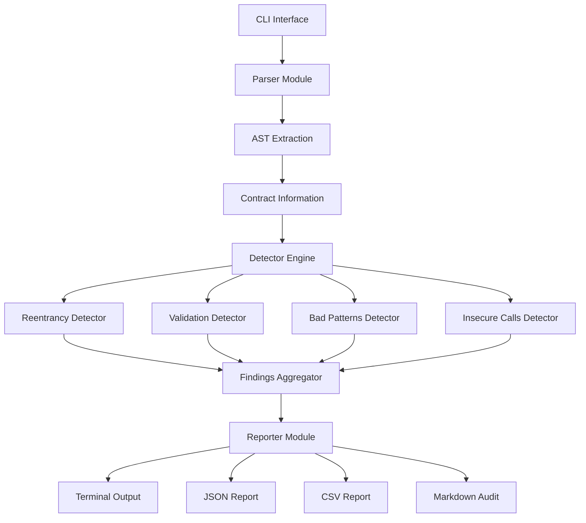

# Architecture Documentation

## Overview

Solidity Vulnerability Scanner is a static analysis tool designed to detect security vulnerabilities in Solidity smart contracts. The architecture follows clean architecture principles with clear separation of concerns, modularity, and extensibility.

## System Architecture



## Component Architecture

### 1. CLI Module (`cli.py`)

**Responsibility**: Command-line interface and orchestration

**Key Components**:
- Argument parsing using `argparse`
- File discovery and scanning coordination
- Exit code management for CI/CD integration
- Security scoring calculation

**Design Patterns**:
- Command pattern for CLI commands
- Factory pattern for detector instantiation

### 2. Parser Module (`parser.py`)

**Responsibility**: Solidity source code parsing and AST extraction

**Key Components**:
- `SolidityParser`: Main parser class
- `ContractInfo`: Contract metadata structure
- `FunctionNode`: Function representation
- `StateVariable`: State variable representation
- `ExternalCall`: External call representation

**Parsing Strategy**:
- Regex-based pattern matching for contract structure
- Line-by-line analysis for function bodies
- Position tracking for accurate reporting

**Limitations**:
- Currently uses regex parsing (lightweight but less accurate than full AST)
- Future enhancement: Integrate with `solidity-parser-py` or `py-solc-x` for full AST

### 3. Detector Engine (`detectors/`)

**Responsibility**: Vulnerability detection using various detection strategies

**Architecture**:
- Base detector class (`BaseDetector`) with abstract `detect()` method
- Each detector inherits from `BaseDetector`
- Detectors operate independently and can be composed

**Detector Modules**:

#### 3.1 Reentrancy Detector (`reentrancy.py`)

**Detection Strategies**:
1. **CEI Pattern Violation**: Checks if external calls occur before state updates
2. **Missing Guards**: Identifies functions with external calls but no `nonReentrant` modifier
3. **Deprecated Patterns**: Flags use of `call.value()`, `send()`, `transfer()`
4. **Fallback Vectors**: Detects public payable functions callable via fallback

**Algorithm**:
```
For each function:
  1. Extract external call positions
  2. Extract state write positions
  3. Compare positions to detect CEI violations
  4. Check for reentrancy guards
  5. Identify deprecated call patterns
```

#### 3.2 Validation Detector (`validation.py`)

**Detection Strategies**:
1. **Missing Input Validation**: Checks for `require()` statements
2. **Unsafe Arithmetic**: Detects arithmetic operations without overflow checks (Solidity < 0.8)
3. **Hardcoded Addresses**: Identifies hardcoded Ethereum addresses

#### 3.3 Bad Patterns Detector (`bad_patterns.py`)

**Detection Strategies**:
1. **Insecure Randomness**: Flags `block.timestamp`, `blockhash()`, etc.
2. **Unprotected Admin Functions**: Identifies admin functions without access control
3. **Missing Events**: Detects important state changes without events
4. **tx.origin Usage**: Flags use of `tx.origin` for authorization

#### 3.4 Insecure Calls Detector (`insecure_calls.py`)

**Detection Strategies**:
1. **Unsafe delegatecall**: Detects dangerous `delegatecall` usage
2. **Unchecked Returns**: Identifies external calls without return value checks

### 4. Reporter Module (`reporter.py`)

**Responsibility**: Report generation in multiple formats

**Output Formats**:
1. **Terminal**: Color-coded, human-readable output
2. **JSON**: Machine-readable format for CI/CD integration
3. **CSV**: Spreadsheet-compatible findings list
4. **Markdown**: Professional security audit report

**Design**:
- Single `Reporter` class handles all formats
- Format-specific methods for each output type
- Consistent data structure across all formats

## Data Flow

```
Solidity Source Code
    ↓
Parser (Extract Structure)
    ↓
Contract Information Objects
    ↓
Detector Engine (Parallel Detection)
    ↓
Findings List
    ↓
Reporter (Format & Output)
    ↓
Reports (Terminal/JSON/CSV/Markdown)
```

## Design Patterns Used

### 1. Strategy Pattern
- Different detectors implement the same interface (`BaseDetector`)
- Allows easy addition of new detectors

### 2. Template Method Pattern
- `BaseDetector` defines the detection template
- Subclasses implement specific detection logic

### 3. Factory Pattern
- Detector instantiation in CLI module
- Reporter creation based on output format

### 4. Observer Pattern (Potential)
- Could be extended for real-time detection feedback
- Currently uses batch processing

## Error Handling Strategy

### Levels of Error Handling

1. **Parser Level**: Graceful degradation on parse errors
   - Logs warnings for unparseable sections
   - Continues processing other contracts

2. **Detector Level**: Exception handling per detector
   - Each detector catches its own exceptions
   - Failures in one detector don't affect others

3. **CLI Level**: User-friendly error messages
   - Clear error messages for file not found, permission errors
   - Appropriate exit codes for CI/CD

### Logging Strategy

- **INFO**: Normal operation (file scanning, report generation)
- **WARNING**: Non-critical issues (parse warnings, missing contracts)
- **ERROR**: Critical failures (file read errors, detector exceptions)

## Extensibility Points

### Adding New Detectors

1. Create new detector class inheriting from `BaseDetector`
2. Implement `detect()` method
3. Register in `detectors/__init__.py`
4. Add to detector list in `cli.py`

### Adding New Output Formats

1. Add new method to `Reporter` class
2. Follow existing format method pattern
3. Add format option to CLI argument parser

### Enhancing Parser

1. Current: Regex-based (lightweight, fast)
2. Future: Full AST parsing with `solidity-parser-py`
3. Migration path: Gradual enhancement while maintaining compatibility

## Performance Considerations

### Current Optimizations

1. **Single-Pass Parsing**: Contracts parsed once, analyzed multiple times
2. **Lazy Evaluation**: Findings generated only when needed
3. **Regex Caching**: Compiled regex patterns reused

### Future Optimizations

1. **Parallel Processing**: Multiple files scanned concurrently
2. **Incremental Parsing**: Only re-parse changed files
3. **Caching**: Cache parsed contracts for repeated scans

## Security Considerations

### Input Validation

- All file paths validated before access
- Source code size limits (prevent memory exhaustion)
- Safe regex patterns (prevent ReDoS)

### Output Security

- No sensitive data in reports
- Safe file writing (atomic operations)
- Path traversal prevention

## Testing Strategy

### Unit Tests

- Individual detector tests
- Parser component tests
- Reporter format tests

### Integration Tests

- End-to-end scanning tests
- Multi-contract file tests
- Report generation tests

### Test Data

- Example vulnerable contracts
- Example safe contracts
- Edge case contracts

## Dependencies

### Core Dependencies

- **Python Standard Library Only**: No external dependencies required
- **Future**: Optional AST parser integration

### Development Dependencies

- **pytest**: Testing framework
- **black**: Code formatting
- **flake8**: Linting
- **mypy**: Type checking
- **isort**: Import sorting

## Deployment Architecture

### Standalone Tool

- Single Python package
- CLI entry point via `setup.py`
- No server or daemon required

### CI/CD Integration

- Exit codes for pipeline integration
- JSON output for automated processing
- Configurable severity thresholds

## Future Enhancements

### Planned Features

1. **Full AST Parsing**: Integration with Solidity compiler AST
2. **Custom Rule Engine**: User-defined detection rules
3. **Fix Suggestions**: Automated fix recommendations
4. **IDE Integration**: VS Code, IntelliJ plugins
5. **Web Dashboard**: Web-based report viewer
6. **Database Backend**: Historical tracking of vulnerabilities

### Scalability Considerations

- **Current**: Single-threaded, suitable for small to medium projects
- **Future**: Multi-threaded processing for large codebases
- **Future**: Distributed scanning for enterprise deployments

## API Design (Future)

### REST API (Planned)

```
POST /api/v1/scan
  Body: { "source_code": "...", "file_path": "..." }
  Response: { "findings": [...], "score": 85 }

GET /api/v1/detectors
  Response: { "detectors": [...] }

POST /api/v1/custom-rule
  Body: { "rule": "...", "pattern": "..." }
```

## Configuration Management

### Current

- Hardcoded detection rules
- CLI arguments for basic configuration

### Future

- Configuration file support (YAML/TOML)
- Rule customization
- Severity threshold configuration
- Output format presets

## Monitoring & Observability

### Current

- Basic logging to stdout/stderr
- Exit codes for CI/CD

### Future

- Structured logging (JSON)
- Metrics collection
- Performance profiling
- Usage analytics

---

**Last Updated**: 2024-01-15  
**Version**: 1.0.0  
**Maintainer**: Solidity Vulnerability Scanner Team

