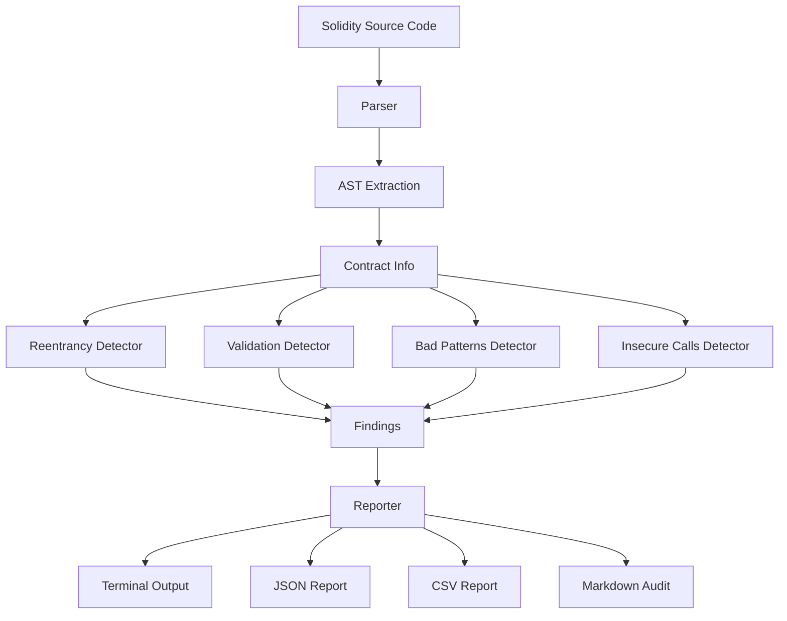

# 🔒 Solidity Vulnerability Scanner

[](https://www.python.org/)
[](LICENSE)
[](https://github.com/psf/black)
[](tests/)
[](htmlcov/)

A comprehensive static analysis tool for detecting **reentrancy vulnerabilities** and other common security issues in Solidity smart contracts. Built with Python, this scanner helps developers identify dangerous patterns before deployment.

> **⚠️ Important**: This tool is for educational and development purposes. Always have your smart contracts audited by professional security firms before deploying to mainnet.

## 📋 Table of Contents

- [Overview](#overview)
- [What is Reentrancy?](#what-is-reentrancy)
- [Why This Scanner Matters](#why-this-scanner-matters)
- [Features](#features)
- [Installation](#installation)
- [Usage](#usage)
- [Architecture](#architecture)
- [Vulnerability Detection](#vulnerability-detection)
- [Real-World Attacks](#real-world-attacks)
- [Contributing](#contributing)
- [License](#license)

## 🎯 Overview

The Solidity Vulnerability Scanner performs static analysis on Solidity source code to identify:

- **Reentrancy vulnerabilities** (CRITICAL)
- **CEI pattern violations** (Checks-Effects-Interactions)
- **Missing input validation**
- **Unprotected admin functions**
- **Insecure randomness**
- **Deprecated call patterns**
- **Hardcoded addresses**
- **And more...**

## 🔐 What is Reentrancy?

Reentrancy is one of the most dangerous vulnerabilities in smart contracts. It occurs when a contract makes an external call to another contract before updating its own state. An attacker can exploit this by creating a malicious contract that calls back into the vulnerable function before the state update completes.

### Example of a Reentrancy Attack

```solidity
// VULNERABLE CODE
function withdraw(uint256 amount) public {
    require(balances[msg.sender] >= amount);
    
    // External call BEFORE state update - VULNERABLE!
    msg.sender.call{value: amount}("");
    
    // State update happens AFTER - too late!
    balances[msg.sender] -= amount;
}
```

**Attack Scenario:**
1. Attacker calls `withdraw(100)`
2. Contract sends 100 ETH to attacker
3. Attacker's fallback function calls `withdraw(100)` again
4. Balance check still passes (not updated yet!)
5. Contract sends another 100 ETH
6. Process repeats until contract is drained

### Safe Pattern (CEI)

```solidity
// SAFE CODE - Follows CEI pattern
function withdraw(uint256 amount) public nonReentrant {
    // Checks
    require(balances[msg.sender] >= amount);
    
    // Effects - Update state FIRST
    balances[msg.sender] -= amount;
    
    // Interactions - External call LAST
    (bool success, ) = msg.sender.call{value: amount}("");
    require(success, "Transfer failed");
}
```

## 🚨 Why This Scanner Matters

Smart contract vulnerabilities have led to billions of dollars in losses:

- **The DAO Hack (2016)**: $60M stolen via reentrancy
- **Lendf.me (2020)**: $25M lost to reentrancy attack
- **dForce (2020)**: $25M drained through reentrancy
- **Parity Wallet (2017)**: $30M frozen due to delegatecall bug

This scanner helps prevent such disasters by catching vulnerabilities **before deployment**.

## ✨ Features

### Detection Capabilities

- ✅ **Reentrancy Detection**: Identifies external calls before state updates
- ✅ **CEI Pattern Analysis**: Validates Checks-Effects-Interactions order
- ✅ **Missing Guards**: Flags functions without `nonReentrant` modifier
- ✅ **Input Validation**: Detects missing `require()` checks
- ✅ **Access Control**: Identifies unprotected admin functions
- ✅ **Insecure Randomness**: Flags `block.timestamp` and `blockhash()` usage
- ✅ **Deprecated Patterns**: Warns about `send()`, `transfer()`, `call.value()`
- ✅ **Hardcoded Addresses**: Detects hardcoded Ethereum addresses
- ✅ **Unsafe Calls**: Identifies dangerous `delegatecall` usage
- ✅ **Missing Events**: Flags important state changes without events

### Reporting Formats

- 🖥️ **Terminal Output**: Color-coded, human-readable results
- 📄 **JSON Report**: Machine-readable format for CI/CD integration
- 📊 **CSV Export**: Spreadsheet-compatible findings list
- 📝 **Markdown Audit**: Professional security audit report

## 📦 Installation

### Prerequisites

- Python 3.8 or higher
- No external dependencies required (uses only Python standard library)

### Install from Source

```bash
# Clone the repository
git clone https://github.com/yourusername/solidity-scanner.git
cd solidity-scanner

# Install the package
pip install -e .

# Or install dependencies only
pip install -r requirements.txt
```

### Verify Installation

```bash
solscan --help
```

## 🚀 Usage

### Basic Scanning

```bash
# Scan a single file
solscan scan MyContract.sol

# Scan a directory
solscan scan ./contracts

# Only show critical/high findings
solscan scan MyContract.sol --critical-only
```

### Output Formats

```bash
# Generate JSON report only
solscan scan MyContract.sol --format json

# Generate CSV report only
solscan scan MyContract.sol --format csv

# Generate Markdown audit report only
solscan scan MyContract.sol --format markdown

# Generate all formats (default)
solscan scan MyContract.sol
```

### Security Score

```bash
# Calculate security score (0-100)
solscan score MyContract.sol
```

### Example Output

```
Scanning: examples/vulnerable.sol
================================================================================

[CRITICAL] Reentrancy Vulnerability: External Call Before State Update
  File: examples/vulnerable.sol:25
  Function: withdraw
  Description: Function 'withdraw' violates the Checks-Effects-Interactions (CEI) pattern...
  
  Code:
  >>>   25 |         msg.sender.call{value: amount}("");
        26 |         
        27 |         balances[msg.sender] -= amount;

  Recommendation:
  Follow the CEI pattern:
  1. Checks: Validate all conditions
  2. Effects: Update state variables
  3. Interactions: Make external calls

================================================================================

Summary:
  CRITICAL: 2
  HIGH: 5
  MEDIUM: 3
  LOW: 2

  Total findings: 12
```

### CI/CD Integration

The scanner returns exit code `1` if critical/high findings are detected, making it perfect for CI pipelines:

```yaml
# GitHub Actions example
- name: Scan Smart Contracts
  run: |
    solscan scan ./contracts --critical-only
    # Exit code 1 will fail the build if vulnerabilities found
```

## 🏗️ Architecture



### Component Overview

- **`parser.py`**: Parses Solidity code and extracts contract structure
- **`detectors/`**: Modular vulnerability detection engines
  - `reentrancy.py`: CEI pattern analysis and reentrancy detection
  - `validation.py`: Input validation and arithmetic checks
  - `bad_patterns.py`: Anti-patterns and insecure practices
  - `insecure_calls.py`: Dangerous call patterns
- **`reporter.py`**: Multi-format report generation
- **`cli.py`**: Command-line interface

## 🔍 Vulnerability Detection

### Reentrancy Detection Rules

The scanner identifies reentrancy vulnerabilities by checking:

1. **CEI Violation**: External calls before state updates
2. **Missing Guards**: Functions with external calls but no `nonReentrant` modifier
3. **Deprecated Patterns**: Use of `call.value()`, `send()`, `transfer()`
4. **Fallback Vectors**: Public payable functions callable via fallback

### Severity Levels

- **CRITICAL**: Immediate risk of fund loss (reentrancy, unprotected admin)
- **HIGH**: Significant security risk (insecure randomness, tx.origin)
- **MEDIUM**: Moderate risk (missing validation, unchecked returns)
- **LOW**: Minor issues (hardcoded addresses, missing events)
- **INFO**: Informational findings

## 🌍 Real-World Attacks

### The DAO Hack (2016)

The most famous reentrancy attack occurred in The DAO, a decentralized autonomous organization. An attacker exploited a reentrancy vulnerability in the `splitDAO` function to drain approximately $60 million worth of Ether. This attack led to a hard fork of Ethereum, creating Ethereum Classic.

**Lesson**: Always follow the CEI pattern and use reentrancy guards.

### Lendf.me (2020)

A DeFi lending protocol lost $25 million due to a reentrancy vulnerability in its `deposit()` function. The attacker was able to re-enter the function before state updates were completed, allowing them to drain funds.

**Lesson**: Even DeFi protocols with audits can have vulnerabilities. Multiple layers of protection are essential.

### dForce (2020)

Another DeFi protocol suffered a $25 million loss from a reentrancy attack. The vulnerability was in the token transfer mechanism, allowing attackers to drain the protocol's reserves.

**Lesson**: Token contracts require the same security scrutiny as main contracts.

### Parity Wallet (2017)

While not strictly a reentrancy attack, Parity Wallet's vulnerability involved unprotected functions and `delegatecall` misuse. An attacker exploited an unprotected `init` function, resulting in $30 million being frozen.

**Lesson**: Access control is critical for all state-changing functions.

## 📝 Example Contracts

The repository includes example contracts demonstrating vulnerabilities and secure patterns:

- **`examples/vulnerable.sol`**: Contains multiple security vulnerabilities
- **`examples/safe.sol`**: Demonstrates secure coding practices

Run the scanner on these examples:

```bash
solscan scan examples/vulnerable.sol
solscan scan examples/safe.sol
```

## 🧪 Testing

Run the test suite:

```bash
python -m pytest tests/
```

Run with coverage:

```bash
python -m pytest tests/ --cov=solidity_scanner
```

## 🤝 Contributing

Contributions are welcome! Please feel free to submit a Pull Request. For major changes, please open an issue first to discuss what you would like to change.

### Development Setup

```bash
# Clone repository
git clone https://github.com/yourusername/solidity-scanner.git
cd solidity-scanner

# Create virtual environment
python -m venv venv
source venv/bin/activate  # On Windows: venv\Scripts\activate

# Install in development mode
pip install -e .

# Run tests
python -m pytest tests/
```

## 📄 License

This project is licensed under the MIT License - see the [LICENSE](LICENSE) file for details.

## 🙏 Acknowledgments

- Inspired by real-world smart contract exploits
- Built to help prevent future attacks
- References to OpenZeppelin security best practices

## 📚 References

- [Consensys Smart Contract Best Practices](https://consensys.github.io/smart-contract-best-practices/)
- [Reentrancy Attacks Explained](https://consensys.github.io/smart-contract-best-practices/attacks/reentrancy/)
- [The DAO Hack Analysis](https://hackingdistributed.com/2016/06/18/analysis-of-the-dao-exploit/)
- [OpenZeppelin Security](https://docs.openzeppelin.com/contracts/4.x/security)

## 💼 Resume Hook

> **"Developed a static-analysis Smart Contract Scanner capable of detecting reentrancy vulnerabilities, insecure patterns, and Solidity anti-patterns using AST parsing and Python. The tool generates professional audit reports and integrates with CI/CD pipelines, helping prevent vulnerabilities that have led to millions in losses."**

---

**⚠️ Disclaimer**: This tool is for educational and development purposes. Always have your smart contracts audited by professional security firms before deploying to mainnet.
